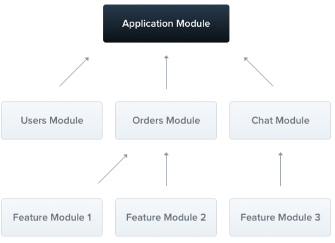
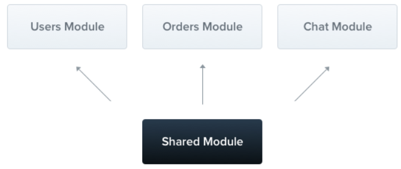

# Modules_3



module과 provider 관계 및 종속성을 해결하는 데 사용하는 데이터 구조

##### module의 속성

providers, controllers, imports, exports

##### 기능 모듈

ex) Cat/cats.module.ts

```typescript
@Module({
	controllers: [CatsController],
	providers: [CatService]
})

export class CatsModule {}
```

CLI를 이용한 모듈 생성

```typescript
$ nest g module cats
```

##### 루트 모듈

ex) app.module.ts

```typescript
@Module({
	imports: [CatsModule],
})

export class AppModule {}
```

##### 공유 모듈



여러 모듈 간에 동일한 인스턴스를 쉽게 공유할 수 있도록 해주는 기능

cats.module.ts

```typescript
@Module({
	controllers: [CatsController],
	providers: [CatsService],
	exports: [CatsService],
})

export class CatsModule {}
```

module -> import, export 같이 사용 가능

: 가져오고 다시 내보내는 용도로 사용

##### 의존성 주입 가능

```typescript
@Module({
	controllers: [CatsController],
	providers: [CatsService],
})
export class CatsModule {
	constuctor(private catsService: CatsService) {}
}
```

모듈 클래스 자체를 주입할 수는 없다.

##### 글로벌 모듈

전역에서 사용하는 모듈

**@Global()** 을 추가하면 모듈의 범위를 전역으로 확장시킬 수 있다.

- 모든 모듈을 글로벌 모듈로 만드는 것은 좋은 디자인이 아님

##### 동적 모듈

provider를 동적으로 등록하고 구성할 수 있는 사용자 지정 가능한 모듈을 쉽게 생성 가능

```typescript
@Module({
	providers: [Connection],
})
export class DatabaseModule {
	static forRoot(entitied = [], options?): DynamicModule {
		consto providers = craeteDatabaseProviders(options, entities);
		return {
			module: DatabbaseModule,
			providers: providers,
			exports: providers,
		};
	}
}
```

```typescript
@Module({
	imports: [DatabaseModule.forRoot([User])],
})
export class AppModule {}
```

```typescript
@Module({
	imports: [DatabaseModule.forRoot([User])],
	exports: [DataBaseModule],
})
export class AppModule {}
```

